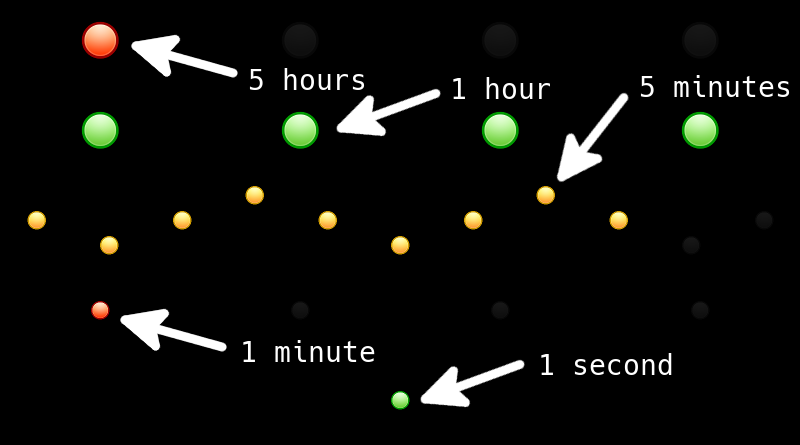

c2k (clock 2000)
================

This is an emulated version of a clock I've once built in school.
It's using Python and SDL2.

# How to install

* Create and active a venv: `python3 -m venv c2k-env && source c2k-env/bin/active`
* Install dependencies using pip: `pip install -r requirements.txt`
* Install SDL2 `apt-get install python3-sdl2` or `pacman -S sdl2 sdl2_image`

# How to use

Just run `python c2k.py` using your venv.

# How to customize

You can swap the lights within the `resources` dir.